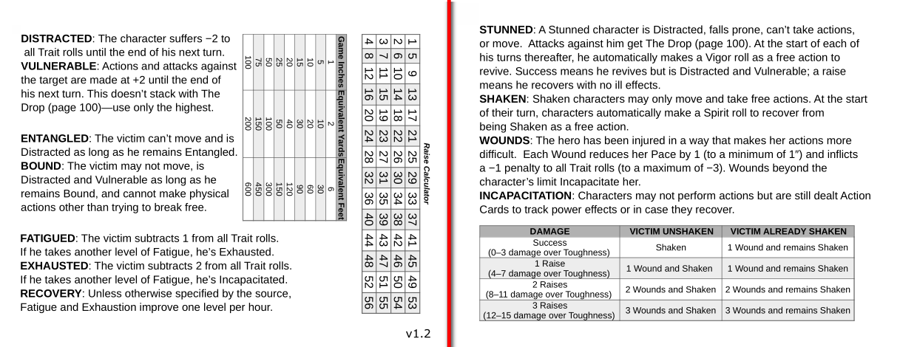

# Savage Worlds Cheat Sheet

This project provides a printable reference cheat sheet for the [Savage Worlds](https://www.peginc.com/product-category/savage-worlds/) tabletop RPG system, specifically the Adventure Edition (aka SWADE). Four copies of the sheet can be printed on a single sheet of paper and both sides are used.

The sheet was created using [LibreOffice Calc](https://www.libreoffice.org/discover/calc/) for the tables and [Inkscape](https://inkscape.org/) for the final layout.

Below is a preview of what both sides of the cheat sheet look like. To print, please [download the PDF from the releases page](https://github.com/jeffrimko/SavageWorldsCheatSheet/releases) and note that four copies of the sheet will be printed to a single two-sided page.

Release notes are maintained in the project [changelog](https://github.com/jeffrimko/SavageWorldsCheatSheet/blob/master/CHANGELOG.md).
